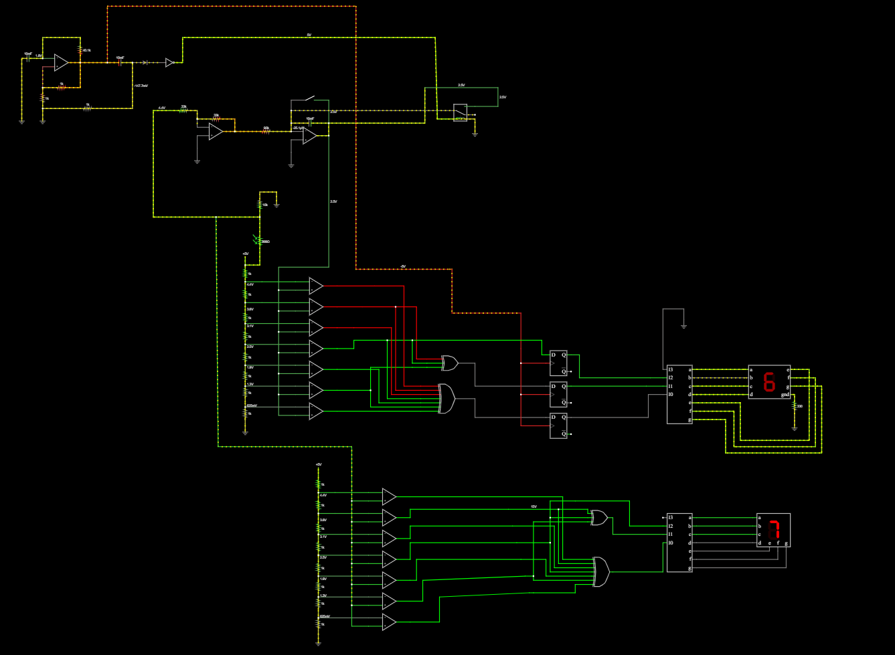

# Advanced Light Intensity Indicator (ALII)
[]()  
[]()  
[]()  
[]()  

A hardware-based light monitoring and display system that translates ambient light levels into a **0–7 scale** using only op-amps, comparators, logic gates, and flip-flops — ensuring stable, reliable readings without microcontrollers or specialized ICs.  


A hardware-based light monitoring and display system that translates ambient light levels into a **0–7 scale** using only op-amps, comparators, logic gates, and flip-flops  ensuring stable, reliable readings without microcontrollers or specialized ICs.

---
### falstad Simulation

---

## Overview

The **ALII** is designed to measure and display light intensity in real time, with built-in **averaging** and **stability features** to avoid flickering outputs. It provides an educational, fully gate-level solution to demonstrate signal conditioning, digital encoding, and sequential logic principles.

The system displays light intensity levels on a **seven-segment display** while allowing users to toggle between **instantaneous values** and **averaged values**, with configurable timing ranges.

---

## Video Explanations

👉 [Demonstration Video Folder](https://drive.google.com/drive/folders/10yKoOL6ZhvUNLYHSySBeZGKUMJKicJC7?usp=drive_link)


---

## Key Features

### Core Functionality

* **Light Measurement**: LDR-based voltage divider converts light into a measurable analog signal.
* **Comparator Network**: Multiple thresholds define intensity levels (0–7).
* **Seven-Segment Display**: Fully gate-level driver converts binary code into segment control signals.
* **Stable Readings**: Flip-flops hold the output for a fixed interval, preventing rapid flicker.
* **Averaging Option**: Integrator-based path averages readings over long intervals for smoother display.
* **Reset Function**: Manual reset clears the average and restarts integration.

### Advanced Features

* **Adjustable Stability Window**: Output hold time selectable between **30–300 seconds**.
* **Adjustable Averaging Period**: RC integrator constants set averaging to **300–900 seconds**.
* **Bypass Mode**: Switch to disable stability hold and show instantaneous values.
* **Solar Power Ready**: Circuit designed for stable low-voltage operation and renewable integration.
* **Discrete Logic Implementation**: No microcontrollers or prebuilt IC decoders used.

---

## System Architecture

```
 ┌─────────────────┐        ┌─────────────────┐
 │  LDR + Divider  │        │  Timer/Oscillator│
 │ (Light Sensor)  │        │ (Generates Clock)│
 └───────┬─────────┘        └─────────┬────────┘
         │                            │
 ┌───────▼─────────┐          ┌───────▼─────────┐
 │ Inverter +      │          │ D Flip-Flops    │
 │ Integrator       │          │ (Stability Hold)│
 └───────┬─────────┘          └───────┬─────────┘
         │                            │
 ┌───────▼──────────┐        ┌────────▼────────┐
 │ Comparator Array │        │ Encoder Logic   │
 │ (0–7 thresholds) │        │ (Binary Output) │
 └───────┬──────────┘        └────────┬────────┘
         │                            │
                 ┌────────────────────▼─────────────────┐
                 │       Seven-Segment Display          │
                 └─────────────────────────────────────┘
```

---

## Hardware Requirements

| Component                 | Purpose                          | Quantity |
| ------------------------- | -------------------------------- | -------- |
| LDR + Resistor Divider    | Light sensing input              | 1        |
| Op-Amps (e.g. LM324)      | Inverter, integrator, comparator | 8–10     |
| Capacitors (10 mF etc.)   | Integrator, timing, averaging    | As req.  |
| Resistors (1k–100k)       | Thresholds, feedback, scaling    | As req.  |
| D Flip-Flops (e.g. 7474)  | Output stability hold            | 3        |
| Logic Gates (74xx series) | Encoder + 7-segment driver       | As req.  |
| Seven-Segment Display     | Intensity level readout          | 1        |
| Switches                  | Mode selection, integrator reset | 2–3      |
| Power Source (Solar/5V)   | System supply                    | 1        |

---

## Software Requirements

* Circuit Simulation: **Falstad**, **LTspice**, or **Multisim**
* Documentation Tools: Markdown / LaTeX for block diagrams

---

## Dashboard / Output Features

* **Seven-segment numeric display** of intensity (levels 0–7).
* **Stable mode**: prevents rapid flicker from noise.
* **Averaged mode**: smooths readings over longer periods.
* **Manual reset**: restart averaging when desired.
* **Solar-powered operation**: optional renewable input source.

---

## Usage

### Measuring Light Intensity

1. Connect the LDR to the divider input.
2. Observe the seven-segment output updating with ambient light.

### Stable Mode

* Enable stability circuit (DFFs).
* Display updates only at defined intervals (30–300 s).

### Averaging Mode

* Enable integrator path.
* Display shows averaged values over 300–900 s.
* Press reset switch to clear and restart averaging.

### Instantaneous Mode

* Disable stability + averaging circuits.
* Comparator outputs feed directly to display.

---

## Future Enhancements

* PCB layout for compact integration.
* Multi-digit display for finer resolution.
* Auto-calibration of comparator thresholds.
* Bluetooth-enabled data logging.
* Web-based visualization of light history.

